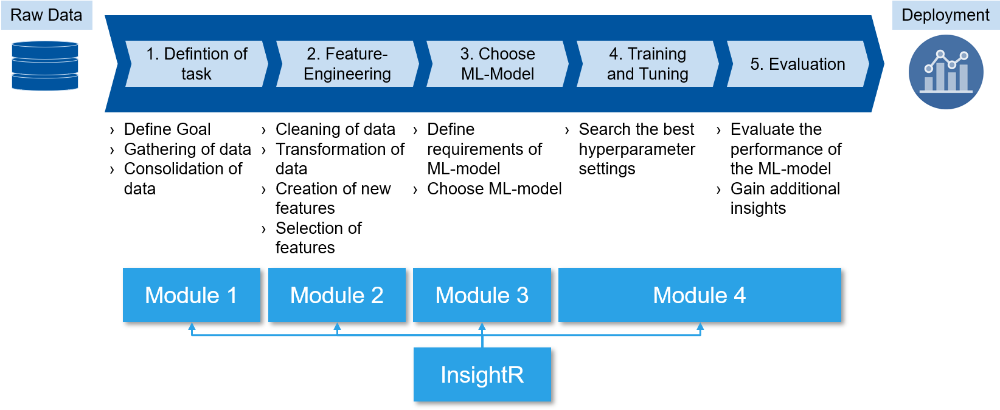

# InsightR
InsightR is a web-application based on R, which supports the workflow of machine learning starting from the extraction of raw data from a relational database and ending with the exploration of the final ML-Model in an easy-to-use manner.

A demo of the application is available at: https://insightr.shinyapps.io/InsightR/

## Overview
The used ML-Workflow consists of 5 steps. The InsightR tool supports the tasks in each of those 5 steps in its 4 modules.[1][2][3][4]

### Module 1
The first step in the ML-Workflow supports the step of the task definition. Besides the definition of the task the data used in the ML-model needs to be defined. 

Therefore, module 1 let's you upload several files to the "Database" of the application. Files (.csv) can be uploaded in bulk or one by one. Several options for layouting the data such as the delimiter, the header and the transformation of features of type string to factors can be set prior to the upload.

In the *"Database"-tab* an Entity-Relation-Diagram of the current Database containing all the uploaded files is provided.

The *"Summary"-tab* shows the datatable itself and summary statistics such as mean, sd, quartiles and a rudimental histogram. This output is created by the skimr-R-package.

The *"Visualization"-tab* provides addition visualization of the chosen dataset using different plot packages (tabplot, mvtsplot, esquisse-R-package). This empowers users to explore the uploaded data inside the database.

In the *"Merge Data"-tab* the files of the database can be consolidated via different methods of joining the data, e.g. Inner Join, Left Join, Right Join, Outer Join.
### Module 2
The Second step of the ML-workflow serves for preparing the consolidated data for the use in a ML-model

The *"Feature-Engineering"-tab* offers differen options for edition the data. Select the columns or rows in the table by clicking on it. When clicking on a column a histogram and boxplot show the distribution of the feature.

**Possible preparation steps:**
* Delete rows or columns
* Quanisation of non-numerical feature columns through "Feature-Hashing" or "One-Hot Encoding"
* Log-Transformation of columns
* Standardisation and/or normailsation of feature columns

The *"Feature-Construction"-tab* helps the user to create new interaction features from the available features in the dataset. Currently addition, substraction, multiplication and division of features is possible.

The *"Feature-Selection"-tab* provides insights on the importance of features towards a target feature. Therefore, a plot shows the relative importance of the features which are chose by the user. Following this step the user can devide the dataset in the training and test dataset.
### Module 3
The third step in the ML-Workflow serves to choose a ML-model according to the requirements of the task itself and the user of the final model.

**There are five characteristics which determine the model:**
* The task: "Regression", "Classification"
* Accuracy: Accuracy of the prediction of the model is determined mainly by the performance on a performance criterion (e.g. MAE, RMSE)  
* Robustness: Robustness of the ml-model towards irrelevant values (e.g. NAs or outliers) 
* Ease-of-use: Ease-of-use is determined whether the model needs a lot of tweaking or wheter it can be easly applied (off-the-shelf)
* Interpretability: Interpretability of the models is determined wheter the background of the prediction of a model is easily coprehendable. Linear models (e.g. decision trees) are usually easier to interpret than complex non-linear models (e.g support-vector machines)
### Module 4
The fourth and fith step of the ML-workflow serve to search for the best fitting ML-model for the task. 

Therefore the *"Training and Tuning"-tab* helps the user to select the target variable and the independent variables, as well as the hyperparameters for tuning the model. The UI on the right shows the outcome of the training in a dotplot. When clicking on the evaluation button the accuracy of the ML-model based on the test dataset is determined. The best ML-model is automatically saved for the next step.

In the *"Exploration"-tab* the user can explore the predictions of the trained ML-model by varying the input values to the model. Addtional insights based on the ML-model (e.g tree structure of the model) are shown in the right panel as well.
### License and used r-packages
This application uses the MIT-License and relies on several R-packages available on CRAN and on gitHub. The following packages need to be installed:

* shiny
* PerformanceAnalytics
* tabplot
* mvtsplot
* skimr
* knitr
* pander
* DiagrammeR
* datamodelr (https://github.com/bergant/datamodelr)
* esquisse
* onehot
* mlbench
* caret
* tidyverse
* ggplot2
* shinyWidgets
* shinythemes
* markdown
* PerformanceAnalytics
* knitr
* pander
* DiagrammeR
* datamodelr
* esquisse
* rpart.plot
* rpart
* e1071
* markdown
* gbm
* randomForest

### Roadmap
* Rpartplot (done: 26.01.2019)
* editable Database model
* improve error handling

---
##### References
* [1] Chollet, F. (2018), Deep learning with Python, Safari Tech Books Online, Manning, Shelter Island, NY.
* [2] Géron, A. (2017), Hands-on machine learning with Scikit-Learn and TensorFlow: Concepts, tools, and techniques to build intelligent systems, First edition, O'Reilly Media, Sebastopol, CA.
* [3] Kotsiantis, S.B. (2007), “Supervised machine learning: A review of classification techniques”, Informatica, Vol. 31 No. 3, 249-268.
* [4] Mitchell, T.M. (1997), Machine learning, McGraw-Hill series in computer science, International ed., McGraw-Hill, New York, NY.