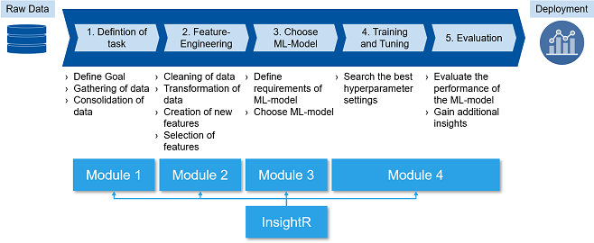
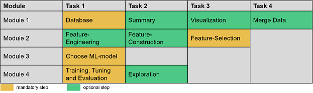

#### What is InsightR?
InsightR is a web-application based on R, which supports the workflow of machine learning starting from the extraction of raw data from a relational database and ending with the exploration of the final ML-Model in an easy-to-use manner.

The source code of the application along with further instructions can be found on gitHub: https://github.com/f-opp/InsightR

Report bugs and issues there - thanks.

#### Overview
The used ML-Workflow consists of 5 steps. The InsightR tool supports the tasks in each of those 5 steps in its 4 modules.

The application is split into four modules, each serving to fulfill different tasks of the workflow. The following table contains the tasks of each of the modules. Some tasks are mandatory to view for the workflow to continue, others are optional.

